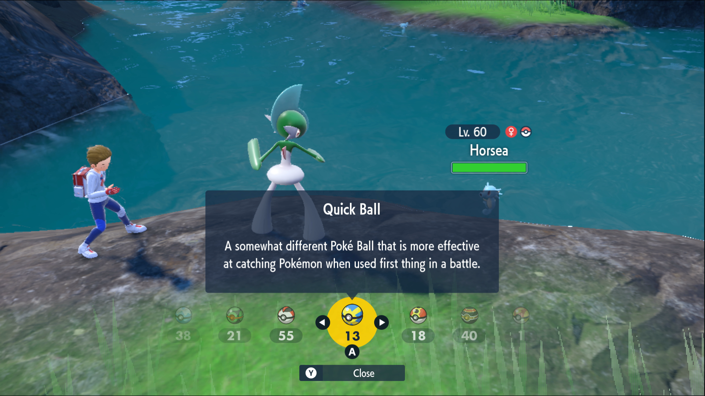
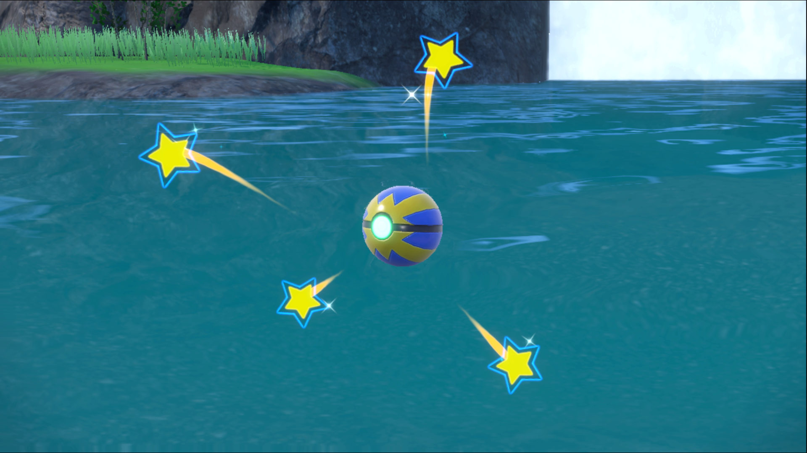
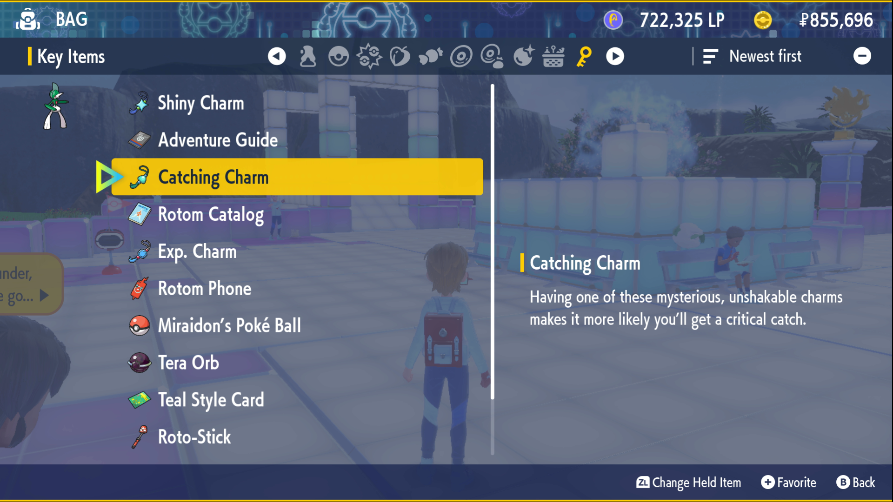
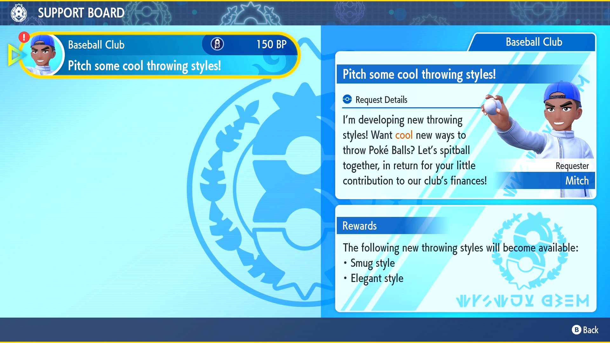
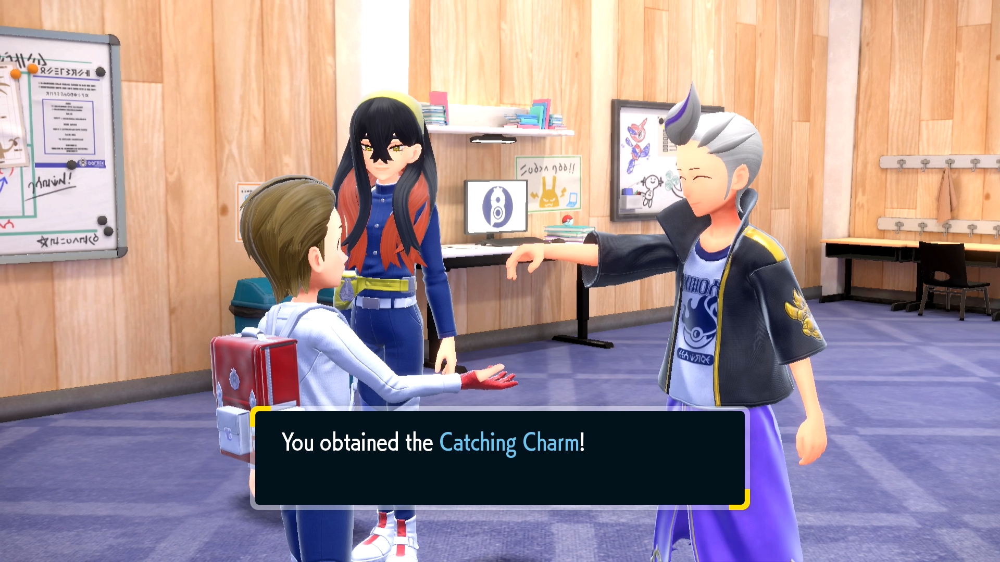

This task is very straightforward, as any Pokémon player has surely caught multiple Pokémon throughout their carreer.

I'll leave this to just a couple of tips then.

  - The best tip I can give regarding catching Pokémon is probably to use **Quick Balls** on your first turn always.
    In the past I've even caught legendaries this way, just based on luck. Any non-legendary Pokémon will have a pretty high catch-rate with Quick Balls.

  - Another great tip is unlocking the **Catching Charm** as soon as possible.
    This is a key item that increases the chance of a critical catch orruring when throwing a Poké Ball at a wild Pokémon.
    (this even works on Quick Balls too, for an additional chance of success)

    - How to unlock this charm?
      In Scarlet and Violet this charm is unlocked after donating the first 150 BP to Mitch from the Baseball Club. (this is done via the League Club Room PC)

    - What is a critical catch?
      Critical captures have been around since Generation V. Critical captures only make one shake check instead of three or four, which means they are considerably more likely to successfully capture the Pokémon.
      Critical captures are calculated on how many Pokémon species have been caught.
      Note:
      Pokémon Scarlet and Violet have a quirk with the animations of critical captures, namely that a successful capture on a Pokémon that is registered in the player's Pokédex will always appear to be a critical capture, even if it is not, and a failed critical capture animates as a normal capture, but with the Pokémon breaking out after no shakes.

Don't forget to check out our tips on all quests [here](https://top-hat-gaming.com/games/pokemon/sv/dlc/guides/Blueberry-quests/).

Let us know how you prefer to complete this quest!
