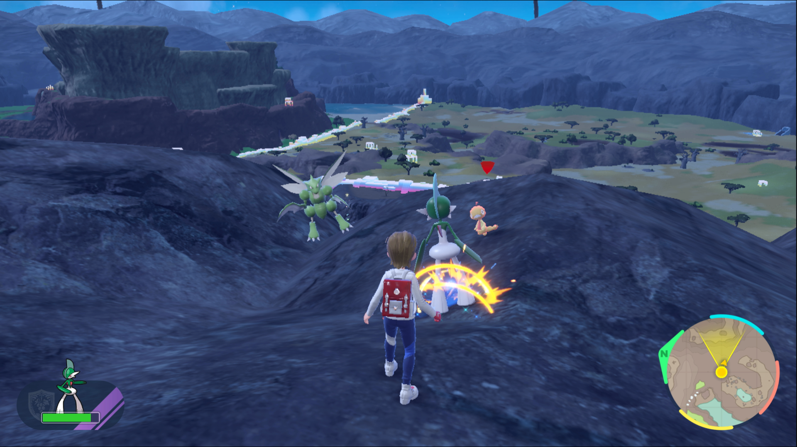
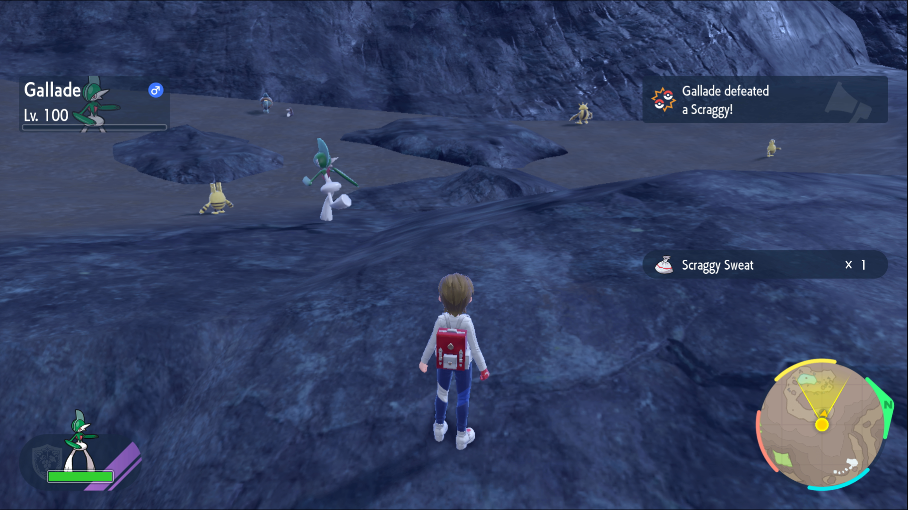
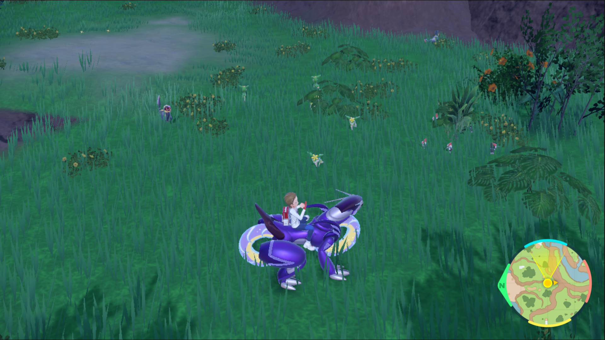

This task is pretty straightforward, just like the name "auto battle" suggests:

Simply let your Pokémon out of its Poké Ball and allow it to take on some wild Pokémon on its own.
You may however not use this feature often, so let's go over it again.

First, head to an area with lots of Pokémon,
and then press your **R** button.
This will unleash the first Pokémon in your party and give them a target, the target will be indicated with a Red marker.

After you've defeated the Pokémon you'll get a confirmation message, and you'll usually receive TM Material specific to the defeated Pokémon species.

In order to complete this quest all you need to do is repeat this process 9 times, for a total of 10!

**TIP**:\
You'll often find small packs of Pokémon across the map.
Try releasing your Pokémon here, as it'll automatically lock onto the next after defeating one.

Don't forget to check out our tips for all quests [here](https://top-hat-gaming.com/games/pokemon/sv/dlc/guides/Blueberry-quests/).

Let us know where you prefer to complete this quest!
